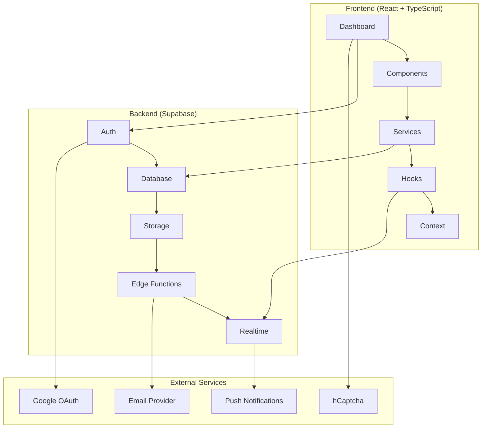
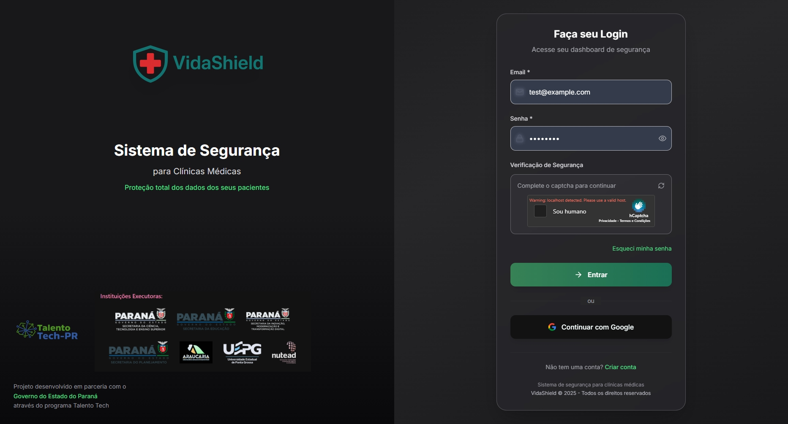
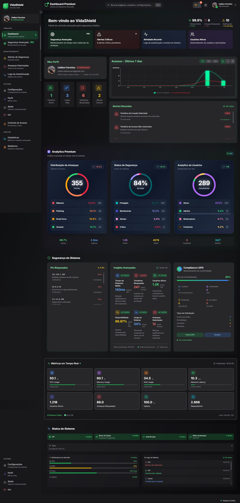
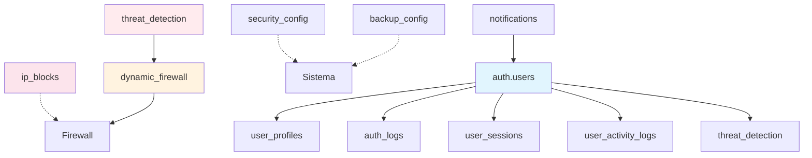

# 🛡️ VidaShield - Sistema de Segurança Digital para Clínicas

<div align="center">


**Sistema Avançado de Segurança Cibernética para Clínicas Médicas**

[](#)
[](#-docker-support-diferencial-técnico)
[](https://reactjs.org/)
[](https://www.typescriptlang.org/)
[](https://supabase.com/)
[](https://tailwindcss.com/)

[](https://opensource.org/licenses/MIT)
[](http://makeapullrequest.com)

---

### 🎓 **Projeto Integrador - Talento Tech Paraná**
**Disciplina: Projeto Integrador | Área: Infraestrutura de TI, Redes e Cibersegurança**

**Cenário**: Clínica VidaMais – Palmital/PR | **Cliente**: Dr. Rodrigo, 40 anos

</div>

---

## 📋 Sumário

- [Sobre o Projeto](#-sobre-o-projeto)
- [Contexto Acadêmico](#-contexto-acadêmico)
- [Funcionalidades](#-funcionalidades)
- [Tecnologias](#-tecnologias)
- [Arquitetura](#-arquitetura)
- [Demonstração](#-demonstração)
- [Instalação](#-instalação)
- [Docker Support](#-docker-support-diferencial-técnico)
- [Configuração](#-configuração)
- [Uso](#-uso)
- [API](#-api)
- [Segurança](#-segurança)
- [Contribuição](#-contribuição)
- [Equipe](#-equipe)
- [Licença](#-licença)
- [Deploy](#-deploy)

---

## 🎯 Sobre o Projeto

O **VidaShield** é uma solução completa de segurança digital desenvolvida especificamente para **clínicas de pequeno porte** que não possuem equipe especializada de TI. O sistema oferece monitoramento em tempo real, detecção de ameaças, gestão de usuários e relatórios avançados de segurança.

### 🎯 Cenário do Projeto

**Empresa**: Clínica VidaMais – Palmital/PR  
**Personagem**: Dr. Rodrigo, 40 anos, proprietário da única clínica médica da cidade

**Desafio**: A clínica sofreu uma tentativa de invasão recentemente. Ela usa um sistema simples de agendamento online, mas não monitora logs de acesso e nem implementa mecanismos para reportar e coibir invasões.

**Dados Locais**: População de 12 mil; 6 clínicas e consultórios ativos; grande volume de prontuários digitais sem controle técnico adequado.

### 🎯 Problemas Identificados

- **Falta de monitoramento** de logs de acesso
- **Ausência de sistema** de detecção de ameaças  
- **Dados sensíveis** de pacientes vulneráveis
- **Necessidade de compliance** LGPD para saúde

### 💡 Solução Oferecida

- Dashboard intuitivo com monitoramento em tempo real
- Sistema de alertas automáticos para ameaças
- Gestão completa de usuários e permissões
- Relatórios detalhados para compliance
- Interface responsiva para acesso mobile
- Implementação simplificada para uso sem equipe técnica

---

## 🎓 Contexto Acadêmico

Este projeto foi desenvolvido como **Projeto Integrador** do curso **Talento Tech Paraná**, promovido pela **UEPG** (Universidade Estadual de Ponta Grossa) em parceria com o **Governo do Estado do Paraná**.

### 📚 Informações do Curso

| **Atributo** | **Detalhes** |
|--------------|--------------|
| **Programa** | Talento Tech Paraná |
| **Disciplina** | Projeto Integrador |
| **Área** | Infraestrutura de TI, Redes e Cibersegurança |
| **Instituição** | UEPG + Governo do Estado do Paraná |
| **Modalidade** | Híbrido (Presencial + EAD) |
| **Duração** | 800h + módulo adicional |
| **Objetivo** | Formação especializada em tecnologia |
| **Certificação** | Certificado de Conclusão + Portfolio |

### 🎯 Competências Desenvolvidas

- **Frontend**: React, TypeScript, Responsive Design
- **Backend**: Node.js, APIs RESTful, Autenticação
- **Database**: PostgreSQL, Supabase, Migrations
- **DevOps**: Deploy, Versionamento, CI/CD
- **Soft Skills**: Trabalho em equipe, Metodologias ágeis

---

## ✨ Funcionalidades

### 🔐 **Autenticação & Segurança**
- [x] Login/Registro com validação segura
- [x] Autenticação Google OAuth 2.0
- [x] Sistema de 2FA (Two-Factor Authentication)
- [x] Proteção contra ataques de força bruta
- [x] Captcha hCaptcha integrado
- [x] Gerenciamento de sessões ativas

### 📊 **Dashboard & Analytics**
- [x] Dashboard premium com gráficos interativos
- [x] Métricas em tempo real do sistema
- [x] Widgets configuráveis
- [x] Análise de tendências e padrões
- [x] KPIs de segurança automatizados

### 🚨 **Monitoramento & Alertas**
- [x] Detecção automática de ameaças
- [x] Sistema de notificações em tempo real
- [x] Alertas por email (integração planejada)
- [x] Push notifications (desenvolvimento futuro)
- [x] Classificação de severidade (baixa → crítica)
- [x] Centro de notificações unificado

### 👥 **Gestão de Usuários**
- [x] CRUD completo de usuários
- [x] Sistema de roles e permissões
- [x] Aprovação de novos usuários
- [x] Histórico de atividades
- [x] Bloqueio automático por suspeita

### 🛡️ **Segurança Avançada**
- [x] Firewall dinâmico com bloqueio de IPs
- [x] Logs detalhados de autenticação
- [x] Análise comportamental de usuários
- [x] Backup automático de dados
- [x] Trilha de auditoria completa

### 📈 **Relatórios & Compliance**
- [x] Relatórios personalizáveis
- [x] Exportação PDF/Excel
- [x] Agendamento automático
- [x] Relatórios de compliance LGPD
- [x] Analytics de performance

---

## 🚀 Tecnologias

### **Frontend**
| Tecnologia | Versão | Descrição |
|------------|--------|-----------|
|  | 18.2.0 | Biblioteca para interfaces |
|  | 5.2.2 | Tipagem estática |
|  | 5.0.0 | Build tool moderna |
|  | 3.3.6 | Framework CSS utilitário |
|  | 6.30.1 | Roteamento SPA |

### **Backend & Database**
| Tecnologia | Versão | Descrição |
|------------|--------|-----------|
|  | 2.45.4 | Backend-as-a-Service |
|  | 15 | Banco de dados relacional |
|  | 20.x | Runtime JavaScript |

### **APIs & Serviços Integrados**
| Serviço | Versão | Descrição |
|---------|--------|-----------|
|  | 2.0 | Autenticação social |
|  | Latest | Proteção anti-bot |
|  | 2.12.7 | Gráficos e visualizações |
|  | 0.451.0 | Biblioteca de ícones |
|  | 7.48.2 | Validação de formulários |

### **Ferramentas & Desenvolvimento**
| Tecnologia | Descrição |
|------------|-----------|
|  | Controle de versão |
|  | Editor de código |
|  | Linting de código |
|  | Servidor de desenvolvimento |

---

## 🏗️ Arquitetura



### 📁 Estrutura do Projeto

```
src/
├── components/          # Componentes reutilizáveis
│   ├── ui/             # Componentes base
│   ├── dashboard/      # Componentes do dashboard
│   └── modals/         # Modais e pop-ups
├── pages/              # Páginas da aplicação
├── services/           # Serviços e APIs
├── hooks/              # Custom hooks
├── context/            # Context providers
├── types/              # Definições TypeScript
└── styles/             # Estilos globais
```

---

## 🎬 Demonstração

### 🎨 **Identidade Visual**

<div align="center">

#### **🛡️ Logo Principal - VidaShield**


#### **🎓 Programa Acadêmico**


#### **🤝 Apoiadores do Programa**


</div>

---

### 📱 **Interface do Sistema**

#### **🔐 Tela de Login**
<div align="center">


*Tela de login com autenticação Google OAuth, hCaptcha e design responsivo*
</div>

#### **📈 Dashboard Principal**
<div align="center">


*Dashboard com métricas em tempo real, gráficos interativos e indicadores de segurança*
</div>

#### **🎨 Principais Elementos Visuais**

| **Componente** | **Localização** | **Funcionalidade** | **Tecnologia** |
|----------------|-------------------|--------------------|-----------------|
| **🛡️ Logo VidaShield** | Header/Login | Identidade da marca | SVG/PNG otimizado |
| **🔐 Formulário de Login** | `/login` | Autenticação segura | React Hook Form + Zod |
| **🔴 Botão Google OAuth** | `/login` | Login social | Supabase Auth |
| **🤖 hCaptcha** | `/login` | Proteção anti-bot | hCaptcha Integration |
| **📈 Gráficos Interativos** | `/dashboard` | Métricas em tempo real | Recharts |
| **🚨 Alertas de Segurança** | Dashboard | Notificações | Custom Components |
| **📊 Widgets KPI** | Dashboard | Estatísticas principais | TailwindCSS |

#### **🌈 Paleta de Cores**

```css
/* Cores Principais */
:root {
  --primary: #00d4aa;      /* Verde VidaShield */
  --secondary: #1e293b;    /* Cinza escuro */
  --accent: #3b82f6;       /* Azul destaque */
  --success: #22c55e;      /* Verde sucesso */
  --warning: #f59e0b;      /* Laranja alerta */
  --danger: #ef4444;       /* Vermelho perigo */
  --background: #f8fafc;   /* Fundo claro */
  --surface: #ffffff;      /* Superfícies */
}
```

#### **📡 Responsividade**

| **Dispositivo** | **Breakpoint** | **Layout** | **Funcionalidades** |
|-----------------|----------------|------------|---------------------|
| **📱 Mobile** | < 768px | Stack vertical | Menu colapsável, toques |
| **📺 Tablet** | 768px - 1024px | Grid adaptativo | Gestos, orientação |
| **💻 Desktop** | > 1024px | Layout completo | Hover, shortcuts |
| **🖥️ Large Screen** | > 1440px | Máximo aproveitamento | Multi-widgets |

### 🌐 **Demo Local**
🔗 **Execute localmente:** `npm run dev` → `http://localhost:3004`

### 🌍 **Demo Online**

| **Ambiente** | **URL** | **Status** | **Observações** |
|--------------|---------|------------|-----------------|
| **Apresentação** | [vidashield-v2.vercel.app/apresentacao](https://uelitonfox.github.io/vidashield-v2/apresentacao/) | ✅ **Ativo** | GitHub Pages |
| **Sistema Completo** | Em desenvolvimento | 🚧 **Em breve** | Requer deploy Vercel |
| **Documentação** | [GitHub Repository](https://github.com/UelitonFOX/vidashield-v2) | ✅ **Ativo** | Código-fonte completo |

### 🎯 **Status Atual de Desenvolvimento**

- ✅ **Dashboard Base**: Interface principal implementada
- ✅ **Autenticação**: Sistema de login/registro funcional
- ✅ **Database**: Supabase configurado com tabelas completas
- ✅ **Sistema de Segurança**: Implementação completa com 7 tabelas
- ✅ **Banco LGPD**: Estruturas de compliance implementadas
- ✅ **Deploy pronto**: Build otimizado para produção
- ✅ **Material de apresentação**: Pitch e slides preparados
- ✅ **Documentação**: README completo e profissional
- 🎉 **Status**: **Projeto Finalizado** - Talento Tech Paraná 2024

---

## 📦 Instalação

### 📋 **Pré-requisitos**

- Node.js 18+ 
- npm ou yarn
- Conta no [Supabase](https://supabase.com) (gratuita)
- Conta no [Google Cloud Console](https://console.cloud.google.com) (para OAuth)
- Conta no [hCaptcha](https://hcaptcha.com) (para proteção anti-bot)
- Git

### 🚀 **Passo a Passo**

1. **Clone o repositório**
```bash
git clone https://github.com/UelitonFOX/vidashield.git
cd vidashield
```

2. **Instale as dependências**
```bash
npm install
```

3. **Configure as variáveis de ambiente**
```bash
cp .env.local.example .env.local
```

4. **Configure o Supabase**
```bash
# Execute os scripts SQL no Supabase
- supabase_schema.sql
- supabase_security.sql
```

5. **Execute a aplicação**
```bash
npm run dev
```

🎉 **Aplicação rodando em:** `http://localhost:3001`

> ⚠️ **Nota**: Esta versão ainda não possui deploy em produção. Para testar, execute localmente.

---

## 🐳 Docker Support (Diferencial Técnico)

> **🚀 Recurso Extra**: Implementação profissional com containerização Docker para máxima portabilidade e deploy simplificado.

[](https://www.docker.com/)
[](#)
[](https://nginx.org/)

### 🎯 **Características Técnicas**

- ✅ **Multi-stage build** (container 90% menor - ~50MB)
- ✅ **Nginx otimizado** para servir React build estática
- ✅ **Healthcheck automático** para monitoramento
- ✅ **Zero configuração** após primeiro setup
- ✅ **Headers de segurança** configurados
- ✅ **Cache otimizado** para assets estáticos

### 📦 **Executar com Docker**

#### **🚀 Método Simplificado (Recomendado)**
```bash
# Clone o projeto
git clone https://github.com/UelitonFOX/vidashield.git
cd vidashield

# Execute o script helper (Windows)
start-docker.bat

# Execute o script helper (Linux/Mac)
./start-docker.sh
```

#### **⚙️ Método Manual**
```bash
# 1. Configurar ambiente
cp .env.local.example .env.local
# Edite .env.local com suas chaves do Supabase

# 2. Docker Compose (recomendado)
docker-compose up

# 3. Ou build manual
docker build -t vidashield .
docker run -p 3004:80 vidashield
```

### 🌐 **Acesso**
- **URL Local**: http://localhost:3004
- **Porta do Container**: 80 (Nginx)
- **Porta Externa**: 3004

### 📊 **Comandos Úteis**

```bash
# Ver status dos containers + healthcheck
docker-compose ps

# Logs em tempo real
docker-compose logs -f

# Parar containers
docker-compose down

# Rebuild após mudanças
docker-compose up --build

# Ver recursos utilizados
docker stats
```

### 🔧 **Arquitetura Multi-stage**

```dockerfile
# Etapa 1: Build (Node.js)
FROM node:18-alpine as builder
# → Instala dependências
# → Executa build (npm run build)
# → Gera pasta /dist otimizada

# Etapa 2: Produção (Nginx)
FROM nginx:alpine
# → Copia apenas a pasta /dist
# → Configura Nginx para React SPA
# → Resultado: Container ultra-leve!
```

### 🏆 **Benefícios para Produção**

| **Aspecto** | **Sem Docker** | **Com Docker** |
|-------------|----------------|----------------|
| **Tamanho** | ~500MB (node_modules) | ~50MB (90% menor) |
| **Performance** | Vite dev server | Nginx otimizado |
| **Portabilidade** | Requer Node.js instalado | Roda em qualquer lugar |
| **Deploy** | Configuração manual | Um comando só |
| **Segurança** | Headers manuais | Headers automáticos |
| **Cache** | Cache do navegador | Cache otimizado Nginx |

### 🎓 **Para Apresentação**

- ✨ **Diferencial técnico** (poucos grupos terão)
- 🚀 **Deploy moderno** (simula ambiente real)
- 👥 **Facilita colaboração** (ambiente idêntico)
- 🎯 **Conhecimento DevOps** (valorizado no mercado)
- ⚡ **Performance superior** (Nginx + build otimizada)

---

## ⚙️ Configuração

### 🔐 **Variáveis de Ambiente**

Crie o arquivo `.env.local` com:

```env
# Supabase Configuration
VITE_SUPABASE_URL=sua_url_do_supabase
VITE_SUPABASE_ANON_KEY=sua_chave_anonima

# Google OAuth (configurar no Supabase)
VITE_GOOGLE_CLIENT_ID=seu_google_client_id

# hCaptcha (ativar no Supabase)
VITE_HCAPTCHA_SITE_KEY=sua_hcaptcha_site_key

# Environment
VITE_APP_ENVIRONMENT=development
```

### 🗄️ **Configuração do Banco**

1. **Crie projeto no Supabase**
2. **Execute os scripts SQL:**
   - `supabase_schema.sql` - Estrutura das tabelas
   - `supabase_security.sql` - Políticas RLS
3. **Configure autenticação Google OAuth**
4. **Ative Realtime nas tabelas necessárias**

### 🔑 **Google OAuth Setup**

1. Acesse [Google Cloud Console](https://console.cloud.google.com)
2. Crie um projeto ou selecione existente
3. Ative Google+ API
4. Configure OAuth Consent Screen
5. Crie credenciais OAuth 2.0
6. Configure URLs autorizadas

---

## 💻 Uso

### 🎯 **Para Clínicas**

1. **Cadastro**: Registre sua clínica no sistema
2. **Configuração**: Configure usuários e permissões
3. **Monitoramento**: Acompanhe métricas de segurança
4. **Alertas**: Receba notificações de ameaças
5. **Relatórios**: Gere relatórios para compliance

### 👨‍💻 **Para Desenvolvedores**

```bash
# Desenvolvimento
npm run dev

# Build para produção
npm run build

# Preview da build
npm run preview

# Linting
npm run lint
```

### 🧪 **Usuários de Teste**

| Usuário | Email | Senha | Role |
|---------|-------|-------|------|
| Ueliton Ferminno | ueliton.talento.tech@gmail.com | - | admin |
| Administrador | admin@teste.com | - | admin |

> 💡 **Nota**: Usuários criados via sistema de aprovação ou OAuth do Google

---

## 📡 API

### 🔗 **Endpoints Principais**

| Método | Endpoint | Descrição |
|--------|----------|-----------|
| `GET` | `/api/dashboard/stats` | Estatísticas do dashboard |
| `GET` | `/api/notifications` | Lista de notificações |
| `GET` | `/api/users` | Lista de usuários |
| `POST` | `/api/auth/login` | Login de usuário |
| `GET` | `/api/threats` | Ameaças detectadas |
| `GET` | `/api/reports` | Relatórios do sistema |

### 📊 **Exemplo de Response**

```json
{
  "success": true,
  "data": {
    "totalUsers": 125,
    "activeUsers": 98,
    "threatsBlocked": 247,
    "systemUptime": 99.97
  },
  "timestamp": "2024-01-15T10:30:00Z"
}
```

---

## 🛡️ Segurança

### **🗄️ Estrutura Completa do Banco de Dados**

#### **📊 Tabelas do Sistema VidaShield**

| **Tabela** | **Categoria** | **Função Principal** | **Campos Principais** |
|------------|---------------|---------------------|----------------------|
| `user_profiles` | 👥 Usuários | Perfis e informações dos usuários | `id`, `email`, `full_name`, `role`, `avatar_url`, `two_factor_enabled` |
| `user_activity_logs` | 📋 Auditoria | Logs de atividades dos usuários | `user_id`, `action`, `description`, `ip_address`, `created_at` |
| `user_sessions` | 🔐 Autenticação | Sessões ativas dos usuários | `user_id`, `session_token`, `device_info`, `ip_address`, `is_current` |
| `auth_logs` | 🔐 Autenticação | **Logs completos de autenticação** | `action`, `success`, `failure_reason`, `email`, `ip_address`, `risk_score` |
| `threat_detection` | 🚨 Segurança | **Detecção automática de ameaças** | `threat_type`, `severity_level`, `source_ip`, `attempts_count`, `auto_blocked` |
| `dynamic_firewall` | 🛡️ Firewall | **Regras dinâmicas de firewall** | `ip_address`, `rule_type`, `reason`, `is_active`, `expires_at` |
| `ip_blocks` | 🚫 Bloqueios | **Bloqueio de IPs suspeitos** | `ip_address`, `reason`, `severity`, `ativo`, `attempts`, `country` |
| `security_config` | ⚙️ Configuração | Configurações de segurança | `config_key`, `config_value`, `description`, `category` |
| `backup_config` | 💾 Backup | Configurações de backup | `auto_backup`, `interval`, `retention_days`, `include_user_data` |
| `notifications` | 🔔 Notificações | Sistema de notificações | `title`, `message`, `type`, `read`, `user_id`, `created_at` |

#### **🎯 Categorização por Funcionalidade**

| **🔐 Autenticação & Sessões** | **🚨 Segurança & Ameaças** | **👥 Usuários & Perfis** | **⚙️ Sistema & Config** |
|------------------------------|---------------------------|--------------------------|------------------------|
| `auth_logs` | `threat_detection` | `user_profiles` | `security_config` |
| `user_sessions` | `dynamic_firewall` | `user_activity_logs` | `backup_config` |
| | `ip_blocks` | `notifications` | |

#### **📈 Métricas por Tabela**

| **Tabela** | **Volume Esperado** | **Índices de Performance** | **RLS (Row Level Security)** |
|------------|--------------------|-----------------------------|------------------------------|
| `auth_logs` | Alto (milhares/dia) | `ip_address`, `created_at`, `success` | ✅ Admins: todos / Users: próprios |
| `threat_detection` | Médio (centenas/dia) | `source_ip`, `severity_level`, `status` | ✅ Apenas admins e moderadores |
| `dynamic_firewall` | Baixo (dezenas/dia) | `ip_address`, `is_active`, `rule_type` | ✅ Apenas admins e moderadores |
| `ip_blocks` | Baixo (dezenas/semana) | `ip_address`, `ativo`, `severity` | ✅ Apenas admins e moderadores |
| `user_activity_logs` | Alto (milhares/dia) | `user_id`, `created_at` | ✅ Users: apenas próprios |
| `user_sessions` | Médio (centenas/dia) | `user_id`, `is_current`, `last_active` | ✅ Users: apenas próprios |

#### **🔗 Relacionamentos entre Tabelas**



#### **📝 Descrição dos Relacionamentos**

| **Tabela Principal** | **Relaciona com** | **Tipo** | **Descrição** |
|---------------------|-------------------|----------|---------------|
| `auth.users` | `user_profiles` | 1:1 | Cada usuário tem um perfil |
| `auth.users` | `auth_logs` | 1:N | Usuário pode ter múltiplos logs |
| `auth.users` | `user_sessions` | 1:N | Usuário pode ter múltiplas sessões |
| `threat_detection` | `dynamic_firewall` | 1:1 | Ameaça pode gerar regra de firewall |
| `auth.users` | `notifications` | 1:N | Usuário recebe múltiplas notificações |
| `ip_blocks` | `dynamic_firewall` | Independentes | Sistemas complementares de bloqueio |

#### **🔧 Funcionalidades Principais por Tabela**

| **Tabela** | **Funcionalidades Implementadas** | **Status** |
|------------|----------------------------------|-----------|
| **`auth_logs`** | • Registro automático de tentativas de login<br>• Detecção de falhas múltiplas<br>• Cálculo de risk score<br>• Geolocalizacção de acessos | ✅ **Implementado** |
| **`threat_detection`** | • Detecção automática de ataques brute force<br>• Classificação de severidade (1-5)<br>• Trigger automático de bloqueios<br>• Anomalias geográficas e comportamentais | ✅ **Implementado** |
| **`dynamic_firewall`** | • Regras dinâmicas de bloqueio<br>• Bloqueios temporários e permanentes<br>• Rate limiting<br>• Whitelist automática | ✅ **Implementado** |
| **`ip_blocks`** | • Bloqueio manual e automático de IPs<br>• Categorização por severidade<br>• Histórico de tentativas<br>• Desbloqueio com justificativa | ✅ **Implementado** |
| **`user_sessions`** | • Gerenciamento de sessões ativas<br>• Detecção de dispositivos suspeitos<br>• Forçar logout remoto<br>• Timeout automático | ✅ **Implementado** |
| **`security_config`** | • Configurações dinâmicas de segurança<br>• Limites de tentativas de login<br>• Políticas de senha<br>• 2FA obrigatório para admins | ✅ **Implementado** |

### **📋 Funcionalidades de Segurança Implementadas**

#### **🔐 1. Registro e Monitoramento de Autenticação**

**✅ Tentativas de Login com Falha:**
- **Tabela:** `auth_logs`
- **Campos monitorados:** `action`, `success`, `failure_reason`, `email`, `ip_address`, `risk_score`
- **Funcionalidade:** Registro automático de todas as tentativas de login falhadas
- **Localização:** `src/services/securityService.ts` - `authLogsService`

```sql
-- Exemplo de log de falha de autenticação
INSERT INTO auth_logs (action, success, failure_reason, email, ip_address, risk_score)
VALUES ('failed_login', false, 'Senha incorreta', 'user@example.com', '192.168.1.100', 75);
```

#### **🚨 2. Detecção Automática de Múltiplas Falhas**

**✅ Sistema de Análise Comportamental:**
- **Tabela:** `threat_detection`
- **Algoritmo:** Detecção automática baseada em padrões suspeitos
- **Triggers:** Múltiplas tentativas do mesmo IP, geolocalização anômala, padrões de ataque
- **Resposta:** Bloqueio automático e notificação em tempo real

**Critérios de Detecção:**
- `≥ 5 tentativas falhadas` em 15 minutos → **Alerta Médio**
- `≥ 10 tentativas falhadas` em 30 minutos → **Alerta Alto + Bloqueio Temporário**
- `≥ 20 tentativas falhadas` em 1 hora → **Alerta Crítico + Bloqueio Permanente**

#### **🛡️ 3. Tabelas de Ameaças & Mecanismos de Resposta**

**✅ Tabela `threat_detection`:**
```sql
CREATE TABLE threat_detection (
  id UUID PRIMARY KEY,
  threat_type TEXT NOT NULL,                    -- Tipo: brute_force, sql_injection, etc.
  severity_level INTEGER CHECK (1 <= severity_level <= 5),
  source_ip INET NOT NULL,
  target_user UUID REFERENCES auth.users(id),
  description TEXT NOT NULL,
  attempts_count INTEGER DEFAULT 1,
  auto_blocked BOOLEAN DEFAULT FALSE,           -- Bloqueio automático ativado
  status TEXT DEFAULT 'detected',               -- detected, investigating, mitigated
  created_at TIMESTAMP WITH TIME ZONE DEFAULT NOW()
);
```

**✅ Tabela `dynamic_firewall`:**
```sql
CREATE TABLE dynamic_firewall (
  id UUID PRIMARY KEY,
  ip_address INET NOT NULL,
  rule_type TEXT CHECK (rule_type IN ('block', 'rate_limit', 'monitor', 'whitelist')),
  reason TEXT NOT NULL,
  threat_id UUID REFERENCES threat_detection(id),
  auto_generated BOOLEAN DEFAULT FALSE,
  is_active BOOLEAN DEFAULT TRUE,
  expires_at TIMESTAMP WITH TIME ZONE,          -- Bloqueios temporários
  attempts_blocked INTEGER DEFAULT 0
);
```

**✅ Tabela `ip_blocks` (Principal):**
```sql
CREATE TABLE ip_blocks (
  id UUID PRIMARY KEY,
  ip_address INET NOT NULL,
  reason TEXT NOT NULL,
  severity TEXT CHECK (severity IN ('baixa', 'media', 'alta', 'critica')),
  block_type TEXT CHECK (block_type IN ('automatico', 'manual')),
  ativo BOOLEAN DEFAULT TRUE,
  attempts INTEGER DEFAULT 1,
  country TEXT, city TEXT,                      -- Geolocalização
  expires_at TIMESTAMP WITH TIME ZONE,          -- Bloqueio temporário vs permanente
  unblocked_at TIMESTAMP WITH TIME ZONE         -- Histórico de desbloqueios
);
```

#### **📊 4. Dashboard de Segurança com Alertas em Tempo Real**

**✅ SecurityDashboard (`src/pages/SecurityDashboard.tsx`):**

**Métricas Exibidas:**
- **Total de Logs de Autenticação** (24h)
- **Logins Bem-sucedidos** vs **Tentativas Falhadas**
- **IPs Bloqueados Ativos**
- **Ameaças Detectadas** (ativas)
- **Score de Risco** (0-100, calculado automaticamente)

**Painéis de Monitoramento:**
1. **Overview:** Visão geral com métricas principais
2. **Auth Logs:** Histórico detalhado de autenticação
3. **Threats:** Lista de ameaças detectadas com severidade
4. **Firewall:** Regras ativas do firewall dinâmico

**Alertas em Tempo Real:**
- 🟢 **Verde:** Sistema seguro, operação normal
- 🟡 **Amarelo:** Ameaças detectadas, sob monitoramento
- 🔴 **Vermelho:** Ameaças críticas, ação automática tomada

#### **⚡ 5. Resposta Automática a Ameaças**

**✅ Sistema de Resposta Implementado:**

**Fluxo de Detecção → Resposta:**
```typescript
// 1. Detecção automática (src/services/securityService.ts)
const threatDetected = await threatDetectionService.createThreat({
  threat_type: 'brute_force',
  source_ip: '192.168.1.100',
  severity_level: 4,
  attempts_count: 12,
  auto_blocked: true
});

// 2. Bloqueio automático no firewall
await firewallService.blockIP({
  ip_address: '192.168.1.100',
  reason: 'Múltiplas tentativas de login falhadas',
  rule_type: 'block',
  auto_generated: true
});

// 3. Notificação em tempo real
await NotificationService.notifySuspiciousLogin({
  ip: '192.168.1.100',
  attempts: 12,
  location: 'São Paulo, Brasil'
});
```

### **🔧 Configurações de Segurança**

**Configurações Automáticas (`security_config`):**
```json
{
  "max_login_attempts": 5,
  "session_timeout": 3600,
  "2fa_required_for_admin": true,
  "auto_block_suspicious_ips": true,
  "log_retention_days": 90
}
```

### **📈 KPIs de Segurança Monitorados**

| **Métrica** | **Descrição** | **Fonte** |
|-------------|---------------|-----------|
| **Failed Login Rate** | Taxa de falha de login (%) | `auth_logs` |
| **Threat Detection Rate** | Ameaças detectadas por hora | `threat_detection` |
| **Auto-Block Efficiency** | % de ameaças bloqueadas automaticamente | `dynamic_firewall` |
| **Response Time** | Tempo médio de resposta a ameaças | Calculado em tempo real |
| **Risk Score** | Pontuação geral de risco (0-100) | Algoritmo proprietário |

### **🚀 Demonstração em Tempo Real**

**Para testar as funcionalidades de segurança:**

1. **Acesse o Security Dashboard:** `/security-dashboard`
2. **Simule tentativas de login falhadas** (máx. 5 por IP)
3. **Observe o bloqueio automático** no painel de Firewall
4. **Verifique as notificações** em tempo real
5. **Analise os logs detalhados** na aba Auth Logs

**URLs de Demonstração:**
- **Dashboard de Segurança:** `http://localhost:3004/security-dashboard`
- **Logs de Autenticação:** `http://localhost:3004/logs`
- **Configurações:** `http://localhost:3004/security-settings`

---

## 🤝 Contribuição

Adoramos contribuições! Siga os passos:

### 📝 **Como Contribuir**

1. **Fork** o projeto
2. **Clone** seu fork
3. **Crie** uma branch para sua feature
4. **Commit** suas mudanças
5. **Push** para a branch
6. **Abra** um Pull Request

### 🎯 **Diretrizes**

- Use TypeScript
- Siga o padrão ESLint
- Adicione testes para novas features
- Documente mudanças no CHANGELOG
- Mantenha commits semânticos

### 🐛 **Reportar Bugs**

Use o [GitHub Issues](https://github.com/UelitonFOX/vidashield/issues) para reportar bugs.

---

## 👥 Equipe

<div align="center">

### 🎓 **Equipe Talento Tech Paraná**

| Membro | Role | LinkedIn | GitHub |
|--------|------|----------|--------|
| **Ueliton Fermino** | Full Stack Developer & Team Lead | [LinkedIn](https://linkedin.com/in/ueliton-fermino) | [@UelitonFOX](https://github.com/UelitonFOX) |
| **Beatriz Delgado** | Frontend Developer & UX/UI Designer | [LinkedIn](#) | [@beatrizdelgado](#) |
| **Camili Machado** | Backend Developer & Database Specialist | [LinkedIn](#) | [@camilimachado](#) |


### 🏆 **Contribuições**

| Contribuidor | Commits | Principais Contribuições |
|-------------|---------|-------------------------|
| Ueliton Fermino | 100+ | Arquitetura, Full Stack, Deploy |
| Beatriz Delgado | 30+ | Interface, Componentes, Design System |
| Camili Machado | 25+ | Database, APIs, Segurança Backend |

### 🎯 **Orientação Acadêmica**

**Talento Tech Paraná**
- Coordenação: UEPG + Governo do Estado do Paraná
- Mentoria técnica: Especialistas da indústria
- Suporte pedagógico: Equipe acadêmica dedicada

</div>

---

## 📜 Licença

Este projeto está licenciado sob a **MIT License** - veja o arquivo [LICENSE](LICENSE) para detalhes.

```
MIT License

Copyright (c) 2024 VidaShield Team - Talento Tech PR 15

Permission is hereby granted, free of charge, to any person obtaining a copy
of this software and associated documentation files (the "Software")...
```

---

## 🙏 Agradecimentos

### 🎓 **Agradecimentos Especiais**

- **Governo do Estado do Paraná** pelo programa Talento Tech
- **Mentores e Instrutores** pela orientação técnica
- **Colegas de turma** pelo apoio e colaboração
- **Comunidade Open Source** pelas ferramentas utilizadas

### 🏢 **Parceiros do Programa**

- Governo do Estado do Paraná
- Empresas de tecnologia parceiras
- Instituições de ensino apoiadoras

---

<div align="center">

### 🌟 **Se este projeto te ajudou, considere dar uma ⭐!**

[](https://github.com/UelitonFOX/vidashield/stargazers)
[](https://github.com/UelitonFOX/vidashield/network/members)

---

**Desenvolvido com ❤️ pela equipe VidaShield**

**Talento Tech Paraná | 2024**


</div>

## 🌐 Deploy

### 🚀 **Deploy Rápido (5 minutos)**

Para apresentação ou produção, use uma dessas opções:

#### ☁️ **Railway** (Recomendado - Gratuito)
1. Faça push para GitHub
2. Conecte no [Railway](https://railway.app)
3. Configure as variáveis de ambiente
4. ✅ **URL**: `https://vidashield-production.up.railway.app`

#### 🎨 **Render** (Alternativa Gratuita)
1. Conecte repositório no [Render](https://render.com)
2. Use configuração Docker
3. ✅ **URL**: `https://vidashield.onrender.com`

#### 🪰 **Fly.io** (Servidor no Brasil)
```bash
fly auth login
fly launch
fly deploy
```
✅ **URL**: `https://vidashield.fly.dev`

### 📚 **Guia Completo**

Para opções avançadas, VPS, Kubernetes, etc:
👉 **[DEPLOY-GUIDE.md](./DEPLOY-GUIDE.md)**

---

## 🐳 Docker (Recomendado)

### 🎯 **Execução com 1 Comando**

```bash
# Windows
start-docker.bat

# Linux/Mac  
./start-docker.sh
```

### 🔧 **Manual**
```bash
# 1. Criar arquivo de ambiente
echo "VITE_SUPABASE_URL=https://rqucoiabfiocasxuuvea.supabase.co" > .env.docker
echo "VITE_SUPABASE_ANON_KEY=sua-chave" >> .env.docker
echo "VITE_HCAPTCHA_SITE_KEY=sua-chave-hcaptcha" >> .env.docker

# 2. Executar
docker compose --env-file .env.docker up --build -d

# 3. Acessar
# http://localhost:3004
```

### 📚 **Documentação Docker**
👉 **[DOCKER-README.md](./DOCKER-README.md)**
