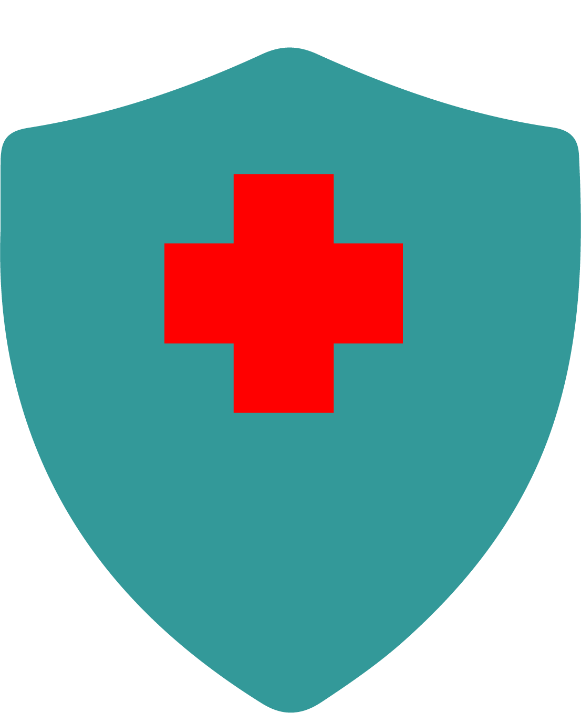

# 🛡️ VidaShield – Sistema de Segurança Digital para Clínicas

> Projeto Integrador – Talento Tech 15  
> Desenvolvido com foco em clínicas de pequeno porte que não possuem equipe de TI.  
> MVP educacional escalável, simples e funcional.

---




---

## 📌 Visão Geral

**VidaShield** é um sistema de segurança digital básico, desenvolvido como **MVP funcional** para monitorar acessos, registrar atividades e simular eventos suspeitos em clínicas pequenas. O projeto foi pensado para resolver problemas reais de segurança com uma solução leve, gratuita e intuitiva.

---

## 🚀 Funcionalidades

- ✅ **Login seguro** com senha criptografada (`bcrypt`)
- ✅ **Registro de acessos** e tentativas inválidas (log)
- ✅ **Dashboard** com filtros e realce de eventos suspeitos
- ✅ **Tela inicial com logo centralizado**
- ✅ **Estrutura modular pronta para expansão**

---

## 🔧 Tecnologias Utilizadas

- `Python 3.11`
- `Streamlit`
- `SQLite`
- `python-dotenv`
- `bcrypt`
- `Plotly` *(planejado para dashboards interativos)*

---

## 📁 Estrutura do Projeto

```plaintext
vidashield/
├── app/
│   ├── main.py
│   ├── auth.py
│   ├── dashboard.py
│   ├── sensors.py
│   ├── logger.py
│   └── __init__.py
├── config/
│   ├── .env
│   └── settings.py
├── data/
│   ├── database.db
│   └── create_db.py
├── assets/
│   └── logo_login.png
├── requirements.txt
├── README.md
└── .gitignore
```

---

## 🎯 Funcionalidades Futuras

- [ ] Menu lateral com navegação pós-login
- [ ] Cadastro e login com conta Google
- [ ] Painel do administrador com gerenciamento de usuários
- [ ] Exportação de relatórios (Excel/CSV)
- [ ] Envio de e-mail em caso de login suspeito
- [ ] Painel do usuário com atualização de cadastro
- [ ] Simulação de sensores físicos (fictícios)
- [ ] Dashboards com gráficos interativos via Plotly

---

## 🧪 Como Executar Localmente

1. Clone o repositório:
```bash
git clone https://github.com/seu-usuario/vidashield.git
```

2. Acesse o diretório:
```bash
cd vidashield
```

3. Instale os requisitos:
```bash
pip install -r requirements.txt
```

4. Crie o banco de dados:
```bash
python data/create_db.py
```

5. Rode o app:
```bash
streamlit run app/main.py
```

---

## 🧠 Desenvolvido por

Ueliton Fox 🦊
Beatriz Delgado
Camili Machado – Projeto Integrador Talento Tech 15  

---
