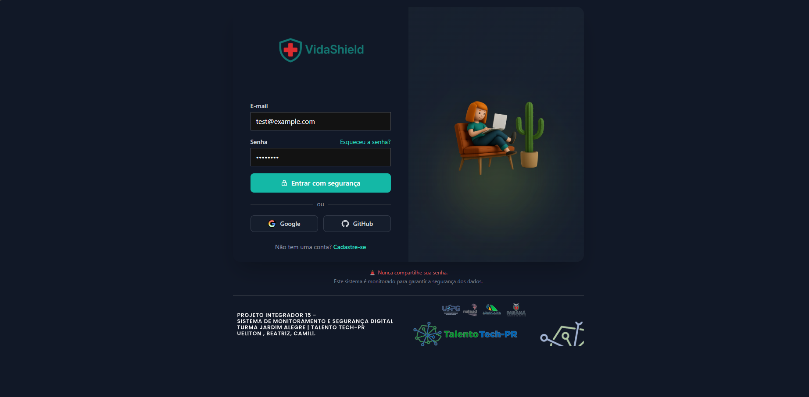
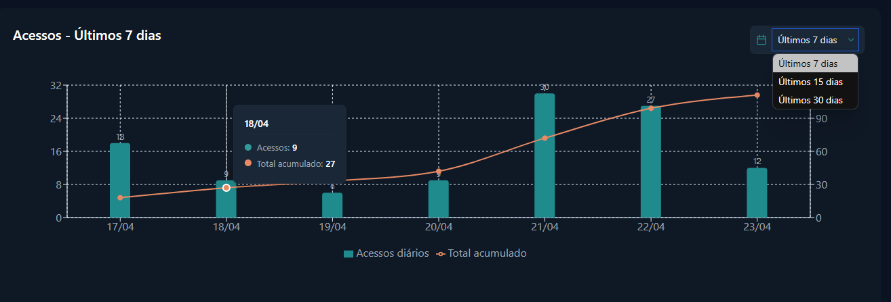

# 🛡️ VidaShield - Sistema de Segurança Digital para Clínicas


> Projeto Integrador – Talento Tech PR 15  
> Desenvolvido com foco em clínicas de pequeno porte que não possuem equipe de TI.  
> Versão 2.0 - Dashboard moderno e responsivo, segurança avançada e relatórios

[](https://reactjs.org/)
[](https://www.python.org/)
[](https://flask.palletsprojects.com/)
[](https://www.typescriptlang.org/)
[](https://github.com/UelitonFOX/vidashield)

---

## 📌 Visão Geral

**VidaShield** é uma solução completa de segurança digital, desenvolvida como parte do Projeto Integrador Talento Tech Paraná. Esta versão 2.0 traz um dashboard moderno e responsivo, sistema de autenticação seguro, monitoramento de acessos em tempo real e relatórios detalhados, projetado especificamente para atender às necessidades de clínicas de pequeno porte que não possuem equipe de TI dedicada.

Nossa missão é proteger dados sensíveis de pacientes e funcionários, detectar atividades suspeitas, e fornecer uma interface intuitiva que permita até mesmo usuários sem conhecimento técnico monitorar a segurança digital da clínica.

> **⚠️ Status do Projeto: Em Desenvolvimento Ativo**  
> Este projeto está sendo ativamente desenvolvido como parte do Projeto Integrador Talento Tech PR. Algumas funcionalidades descritas estão em processo de implementação.

---

## ✅ Funcionalidades Já Implementadas

* **Sistema de Autenticação Completo**:
  * ✓ Tela de login com validação de usuário/senha
  * ✓ Cadastro de novos usuários
  * ✓ Recuperação de senha via e-mail
  * ✓ Autenticação persistente com armazenamento seguro de tokens

* **Dashboard Moderno**:
  * ✓ Interface responsiva adaptada para diferentes dispositivos
  * ✓ Layout com barra lateral de navegação
  * ✓ Cards informativos com principais métricas de segurança
  * ✓ Gráfico interativo de acessos com filtros de período (7, 15, 30 dias)
  * ✓ Seção de alertas recentes com classificação por severidade

* **Backend Estruturado**:
  * ✓ API RESTful para comunicação segura
  * ✓ Endpoints protegidos com autenticação JWT
  * ✓ Armazenamento seguro de senhas com bcrypt
  * ✓ Logging de atividades de acesso

---

## 🔜 Próximos Passos (Em Desenvolvimento)

As seguintes funcionalidades estão em desenvolvimento ativo:

* 🔄 **Sistema de Alertas em Tempo Real** - Notificações push sobre eventos de segurança
* 🔄 **Detecção Avançada de Comportamentos Suspeitos** - Algoritmos para identificação de anomalias
* 🔄 **Módulo de Gerenciamento de Usuários** - Interface administrativa para gestão de acessos
* 🔄 **Exportação de Relatórios** - Geração de relatórios em PDF/CSV para análise offline
* 🔄 **Integração com Sistemas Externos** - Conexão com outros sistemas da clínica

---

## ✨ Funcionalidades Planejadas (v2.0)

* 🆕 **Dashboard completamente redesenhado** com UI moderna e responsiva
* 🆕 **Gráficos interativos** de acessos com filtros de período (7, 15 e 30 dias)
* 🆕 **Painéis detalhados** com estatísticas de usuários, tentativas de invasão e alertas
* 🆕 **Autenticação OAuth** com Google para login seguro e simplificado
* 🆕 **Design responsivo** que funciona em desktop, tablet e mobile
* 🆕 **Tema escuro** com paleta de cores profissional para menor fadiga visual
* 🆕 **Sistema de alertas em tempo real** com notificações importantes

---

## 🚀 Funcionalidades Principais

* ✅ **Login seguro** com senhas criptografadas e autenticação OAuth
* ✅ **Dashboard interativo** com métricas e indicadores importantes
* ✅ **Gráficos analíticos** desenvolvidos com Recharts
* ✅ **Sistema de alertas** com classificações de severidade
* ✅ **Registro de acessos e atividades** com logs detalhados
* ✅ **Detecção de comportamentos suspeitos** para prevenção proativa
* ✅ **Gerenciamento de usuários** com diferentes níveis de acesso
* ✅ **Exportação de relatórios** para análise posterior

---

## 🔧 Tecnologias Utilizadas

### Frontend
* `React` - Biblioteca JavaScript para construção de interfaces
* `TypeScript` - Superset tipado de JavaScript
* `Recharts` - Biblioteca de gráficos para React
* `React Icons` - Pacote de ícones SVG
* `React Router` - Roteamento para navegação na aplicação

### Backend
* `Python 3.11+` - Linguagem de programação do backend
* `Flask` - Framework web minimalista e eficiente
* `SQLite` - Banco de dados relacional leve
* `JWT` - Tokens seguros para autenticação
* `bcrypt` - Criptografia robusta para senhas

---

## 📁 Estrutura do Projeto

```
vidashield/
├── frontend/              # Aplicação React/TypeScript
│   ├── public/            # Recursos públicos (logo, favicon)
│   ├── src/               # Código fonte do frontend
│   │   ├── components/    # Componentes reutilizáveis
│   │   ├── contexts/      # Contextos React (auth, tema)
│   │   ├── pages/         # Páginas da aplicação
│   │   ├── services/      # Serviços e API
│   │   └── App.tsx        # Componente principal
│   └── package.json       # Dependências do frontend
│
├── backend/               # API e lógica do servidor
│   ├── app/               # Módulos da aplicação
│   │   ├── auth.py        # Autenticação e segurança
│   │   ├── dashboard.py   # Endpoints para o dashboard
│   │   ├── logger.py      # Sistema de logging
│   │   └── routes.py      # Rotas da API
│   ├── config/            # Configurações do backend
│   ├── data/              # Banco de dados e migrações
│   └── requirements.txt   # Dependências do backend
│
└── README.md              # Este arquivo
```

---

## 📊 Dashboard

O dashboard do VidaShield oferece uma visão clara e abrangente da segurança digital da clínica:

* **Cards de Métricas Principais**:
  * Usuários Ativos/Inativos
  * Logins nas últimas 24h
  * Alertas críticos
  * Tentativas de invasão bloqueadas
  * Relatórios exportados

* **Gráfico de Acessos**:
  * Visualização de barras para acessos diários
  * Linha acumulativa para tendências
  * Filtros por período (7, 15 e 30 dias)
  * Tooltips interativos com detalhes

* **Painel de Alertas Recentes**:
  * Alertas classificados por severidade
  * Timestamp de ocorrência
  * Detalhes do evento

---

## 🔒 Segurança

O VidaShield foi projetado com foco em segurança:

* Senhas armazenadas com hash seguro (bcrypt)
* Autenticação JWT com expiração de tokens
* Proteção contra ataques de força bruta
* Detecção de padrões suspeitos de acesso
* Logs detalhados para auditoria
* Sanitização de dados em todas as entradas

---

## 🚀 Como Executar Localmente

### Pré-requisitos
* Node.js 16+
* Python 3.11+
* Git

### Frontend
```bash
# Clonar o repositório
git clone https://github.com/UelitonFOX/vidashield.git

# Navegar para o diretório frontend
cd vidashield/frontend

# Instalar dependências
npm install

# Iniciar o servidor de desenvolvimento
npm start
```

### Backend
```bash
# Navegar para o diretório backend
cd ../backend

# Criar ambiente virtual (recomendado)
python -m venv venv
source venv/bin/activate  # No Windows: venv\Scripts\activate

# Instalar dependências
pip install -r requirements.txt

# Iniciar o servidor
python app.py
```

A aplicação estará disponível em `http://localhost:3000` e a API em `http://localhost:5000`.

---

## 📝 Como Contribuir

Se você deseja contribuir com o desenvolvimento do VidaShield, siga os passos abaixo:

1. Faça um fork do repositório
2. Clone o seu fork: `git clone https://github.com/seu-usuario/vidashield.git`
3. Crie uma branch para sua feature: `git checkout -b minha-nova-feature`
4. Faça suas alterações e commit: `git commit -m 'Adiciona nova feature'`
5. Envie para o GitHub: `git push origin minha-nova-feature`
6. Abra um Pull Request no repositório original

Agradecemos antecipadamente por suas contribuições!

---

## 🧠 Desenvolvido por

**Equipe VidaShield**:
* **Ueliton Fermino (Fox)** - Desenvolvedor Full Stack
* **Beatriz Delgado** - UX/UI e Frontend
* **Camili Machado** - Backend e Segurança

> Projeto Integrador – Talento Tech PR 15

---

## 📝 Licença

Este projeto está sob a licença MIT. Veja o arquivo LICENSE para mais detalhes.

---


© 2024 VidaShield - Todos os direitos reservados 

---

## 📸 Screenshots

### Tela de Login

*Interface de login moderna e segura com opção de autenticação via Google.*

### Dashboard Principal

*Dashboard com métricas importantes, gráfico interativo de acessos e alertas recentes.*

### Gráfico de Acessos Interativo

*Gráfico interativo mostrando acessos diários com linha de acumulação e filtros de período.*

--- 