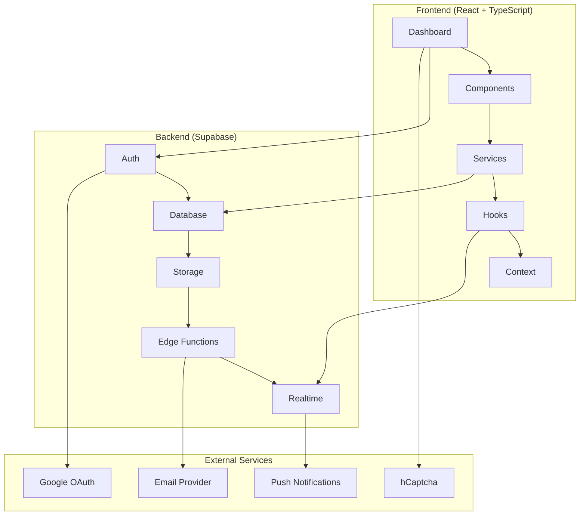

# 🛡️ VidaShield - Sistema de Segurança Digital para Clínicas

<div align="center">


**Sistema Avançado de Segurança Cibernética para Clínicas Médicas**

[](#)
[](https://reactjs.org/)
[](https://www.typescriptlang.org/)
[](https://supabase.com/)
[](https://tailwindcss.com/)

[](https://opensource.org/licenses/MIT)
[](http://makeapullrequest.com)

---

### 🎓 **Projeto Integrador - Talento Tech Paraná**
**Disciplina: Projeto Integrador | Área: Infraestrutura de TI, Redes e Cibersegurança**

**Cenário**: Clínica VidaMais – Palmital/PR | **Cliente**: Dr. Rodrigo, 40 anos

</div>

---

## 📋 Sumário

- [Sobre o Projeto](#-sobre-o-projeto)
- [Contexto Acadêmico](#-contexto-acadêmico)
- [Funcionalidades](#-funcionalidades)
- [Tecnologias](#-tecnologias)
- [Arquitetura](#-arquitetura)
- [Demonstração](#-demonstração)
- [Instalação](#-instalação)
- [Configuração](#-configuração)
- [Uso](#-uso)
- [API](#-api)
- [Segurança](#-segurança)
- [Contribuição](#-contribuição)
- [Equipe](#-equipe)
- [Licença](#-licença)

---

## 🎯 Sobre o Projeto

O **VidaShield** é uma solução completa de segurança digital desenvolvida especificamente para **clínicas de pequeno porte** que não possuem equipe especializada de TI. O sistema oferece monitoramento em tempo real, detecção de ameaças, gestão de usuários e relatórios avançados de segurança.

### 🎯 Cenário do Projeto

**Empresa**: Clínica VidaMais – Palmital/PR  
**Personagem**: Dr. Rodrigo, 40 anos, proprietário da única clínica médica da cidade

**Desafio**: A clínica sofreu uma tentativa de invasão recentemente. Ela usa um sistema simples de agendamento online, mas não monitora logs de acesso e nem implementa mecanismos para reportar e coibir invasões.

**Dados Locais**: População de 12 mil; 6 clínicas e consultórios ativos; grande volume de prontuários digitais sem controle técnico adequado.

### 🎯 Problemas Identificados

- **Falta de monitoramento** de logs de acesso
- **Ausência de sistema** de detecção de ameaças  
- **Dados sensíveis** de pacientes vulneráveis
- **Necessidade de compliance** LGPD para saúde

### 💡 Solução Oferecida

- Dashboard intuitivo com monitoramento em tempo real
- Sistema de alertas automáticos para ameaças
- Gestão completa de usuários e permissões
- Relatórios detalhados para compliance
- Interface responsiva para acesso mobile
- Implementação plug-and-play

---

## 🎓 Contexto Acadêmico

Este projeto foi desenvolvido como **Projeto Integrador** do curso **Talento Tech Paraná**, promovido pela **UEPG** (Universidade Estadual de Ponta Grossa) em parceria com o **Governo do Estado do Paraná**.

### 📚 Informações do Curso

| **Atributo** | **Detalhes** |
|--------------|--------------|
| **Programa** | Talento Tech Paraná |
| **Disciplina** | Projeto Integrador |
| **Área** | Infraestrutura de TI, Redes e Cibersegurança |
| **Instituição** | UEPG + Governo do Estado do Paraná |
| **Modalidade** | Híbrido (Presencial + EAD) |
| **Duração** | 800h + módulo adicional |
| **Objetivo** | Formação especializada em tecnologia |
| **Certificação** | Certificado de Conclusão + Portfolio |

### 🎯 Competências Desenvolvidas

- **Frontend**: React, TypeScript, Responsive Design
- **Backend**: Node.js, APIs RESTful, Autenticação
- **Database**: PostgreSQL, Supabase, Migrations
- **DevOps**: Deploy, Versionamento, CI/CD
- **Soft Skills**: Trabalho em equipe, Metodologias ágeis

---

## ✨ Funcionalidades

### 🔐 **Autenticação & Segurança**
- [x] Login/Registro com validação segura
- [x] Autenticação Google OAuth 2.0
- [x] Sistema de 2FA (Two-Factor Authentication)
- [x] Proteção contra ataques de força bruta
- [x] Captcha hCaptcha integrado
- [x] Gerenciamento de sessões ativas

### 📊 **Dashboard & Analytics**
- [x] Dashboard premium com gráficos interativos
- [x] Métricas em tempo real do sistema
- [x] Widgets configuráveis
- [x] Análise de tendências e padrões
- [x] KPIs de segurança automatizados

### 🚨 **Monitoramento & Alertas**
- [x] Detecção automática de ameaças
- [x] Sistema de notificações em tempo real
- [x] Alertas por email (integração planejada)
- [x] Push notifications (desenvolvimento futuro)
- [x] Classificação de severidade (baixa → crítica)
- [x] Centro de notificações unificado

### 👥 **Gestão de Usuários**
- [x] CRUD completo de usuários
- [x] Sistema de roles e permissões
- [x] Aprovação de novos usuários
- [x] Histórico de atividades
- [x] Bloqueio automático por suspeita

### 🛡️ **Segurança Avançada**
- [x] Firewall dinâmico com bloqueio de IPs
- [x] Logs detalhados de autenticação
- [x] Análise comportamental de usuários
- [x] Backup automático de dados
- [x] Trilha de auditoria completa

### 📈 **Relatórios & Compliance**
- [x] Relatórios personalizáveis
- [x] Exportação PDF/Excel
- [x] Agendamento automático
- [x] Relatórios de compliance LGPD
- [x] Analytics de performance

---

## 🚀 Tecnologias

### **Frontend**
| Tecnologia | Versão | Descrição |
|------------|--------|-----------|
|  | 18.2.0 | Biblioteca para interfaces |
|  | 5.2.2 | Tipagem estática |
|  | 5.0.0 | Build tool moderna |
|  | 3.3.6 | Framework CSS utilitário |
|  | 6.30.1 | Roteamento SPA |

### **Backend & Database**
| Tecnologia | Versão | Descrição |
|------------|--------|-----------|
|  | 2.45.4 | Backend-as-a-Service |
|  | 15 | Banco de dados relacional |
|  | 20.x | Runtime JavaScript |

### **APIs & Serviços Integrados**
| Serviço | Versão | Descrição |
|---------|--------|-----------|
|  | 2.0 | Autenticação social |
|  | Latest | Proteção anti-bot |
|  | 2.12.7 | Gráficos e visualizações |
|  | 0.451.0 | Biblioteca de ícones |
|  | 7.48.2 | Validação de formulários |

### **Ferramentas & Desenvolvimento**
| Tecnologia | Descrição |
|------------|-----------|
|  | Controle de versão |
|  | Editor de código |
|  | Linting de código |
|  | Servidor de desenvolvimento |

---

## 🏗️ Arquitetura



### 📁 Estrutura do Projeto

```
src/
├── components/          # Componentes reutilizáveis
│   ├── ui/             # Componentes base
│   ├── dashboard/      # Componentes do dashboard
│   └── modals/         # Modais e pop-ups
├── pages/              # Páginas da aplicação
├── services/           # Serviços e APIs
├── hooks/              # Custom hooks
├── context/            # Context providers
├── types/              # Definições TypeScript
└── styles/             # Estilos globais
```

---

## 🎬 Demonstração

### 🌐 **Demo Local**
🔗 **Execute localmente:** `npm run dev` → `http://localhost:3001`

### 📱 **Interface Atual**

> 🚧 **Em Desenvolvimento**: Screenshots serão adicionadas após finalização da interface

### 🎯 **Status Atual de Desenvolvimento**

- ✅ **Dashboard Base**: Interface principal implementada
- ✅ **Autenticação**: Sistema de login/registro funcional
- ✅ **Database**: Supabase configurado com tabelas completas
- 🚧 **Frontend Integration**: Conectando interface com backend
- 🚧 **Real-time Features**: Implementando notificações live
- 📋 **Próximas Etapas**: Deploy em produção

---

## 📦 Instalação

### 📋 **Pré-requisitos**

- Node.js 18+ 
- npm ou yarn
- Conta no [Supabase](https://supabase.com) (gratuita)
- Conta no [Google Cloud Console](https://console.cloud.google.com) (para OAuth)
- Conta no [hCaptcha](https://hcaptcha.com) (para proteção anti-bot)
- Git

### 🚀 **Passo a Passo**

1. **Clone o repositório**
```bash
git clone https://github.com/UelitonFOX/vidashield.git
cd vidashield
```

2. **Instale as dependências**
```bash
npm install
```

3. **Configure as variáveis de ambiente**
```bash
cp .env.local.example .env.local
```

4. **Configure o Supabase**
```bash
# Execute os scripts SQL no Supabase
- supabase_schema.sql
- supabase_security.sql
```

5. **Execute a aplicação**
```bash
npm run dev
```

🎉 **Aplicação rodando em:** `http://localhost:3001`

> ⚠️ **Nota**: Esta versão ainda não possui deploy em produção. Para testar, execute localmente.

---

## ⚙️ Configuração

### 🔐 **Variáveis de Ambiente**

Crie o arquivo `.env.local` com:

```env
# Supabase Configuration
VITE_SUPABASE_URL=sua_url_do_supabase
VITE_SUPABASE_ANON_KEY=sua_chave_anonima

# Google OAuth (configurar no Supabase)
VITE_GOOGLE_CLIENT_ID=seu_google_client_id

# hCaptcha (ativar no Supabase)
VITE_HCAPTCHA_SITE_KEY=sua_hcaptcha_site_key

# Environment
VITE_APP_ENVIRONMENT=development
```

### 🗄️ **Configuração do Banco**

1. **Crie projeto no Supabase**
2. **Execute os scripts SQL:**
   - `supabase_schema.sql` - Estrutura das tabelas
   - `supabase_security.sql` - Políticas RLS
3. **Configure autenticação Google OAuth**
4. **Ative Realtime nas tabelas necessárias**

### 🔑 **Google OAuth Setup**

1. Acesse [Google Cloud Console](https://console.cloud.google.com)
2. Crie um projeto ou selecione existente
3. Ative Google+ API
4. Configure OAuth Consent Screen
5. Crie credenciais OAuth 2.0
6. Configure URLs autorizadas

---

## 💻 Uso

### 🎯 **Para Clínicas**

1. **Cadastro**: Registre sua clínica no sistema
2. **Configuração**: Configure usuários e permissões
3. **Monitoramento**: Acompanhe métricas de segurança
4. **Alertas**: Receba notificações de ameaças
5. **Relatórios**: Gere relatórios para compliance

### 👨‍💻 **Para Desenvolvedores**

```bash
# Desenvolvimento
npm run dev

# Build para produção
npm run build

# Preview da build
npm run preview

# Linting
npm run lint
```

### 🧪 **Usuários de Teste**

| Usuário | Email | Senha | Role |
|---------|-------|-------|------|
| Ueliton Ferminno | ueliton.talento.tech@gmail.com | - | admin |
| Administrador | admin@teste.com | - | admin |

> 💡 **Nota**: Usuários criados via sistema de aprovação ou OAuth do Google

---

## 📡 API

### 🔗 **Endpoints Principais**

| Método | Endpoint | Descrição |
|--------|----------|-----------|
| `GET` | `/api/dashboard/stats` | Estatísticas do dashboard |
| `GET` | `/api/notifications` | Lista de notificações |
| `GET` | `/api/users` | Lista de usuários |
| `POST` | `/api/auth/login` | Login de usuário |
| `GET` | `/api/threats` | Ameaças detectadas |
| `GET` | `/api/reports` | Relatórios do sistema |

### 📊 **Exemplo de Response**

```json
{
  "success": true,
  "data": {
    "totalUsers": 125,
    "activeUsers": 98,
    "threatsBlocked": 247,
    "systemUptime": 99.97
  },
  "timestamp": "2024-01-15T10:30:00Z"
}
```

---

## 🔒 Segurança

### 🛡️ **Medidas Implementadas**

- [x] **Autenticação JWT** com refresh tokens
- [x] **2FA** com Google Authenticator
- [x] **Rate Limiting** para APIs
- [x] **SQL Injection** prevenção via RLS
- [x] **XSS Protection** sanitização de inputs
- [x] **CSRF Protection** tokens em requisições
- [x] **Data Encryption** dados sensíveis criptografados
- [x] **Audit Trails** logs completos de ações

### 🔐 **Compliance**

- ✅ **LGPD**: Proteção de dados pessoais (Lei 13.709/2018)
- 🚧 **ISO 27001**: Gestão de segurança da informação (em desenvolvimento)
- 🚧 **CFM**: Normas do Conselho Federal de Medicina (futuro)
- 🚧 **HIPAA**: Padrões internacionais de privacidade (futuro)

---

## 🤝 Contribuição

Adoramos contribuições! Siga os passos:

### 📝 **Como Contribuir**

1. **Fork** o projeto
2. **Clone** seu fork
3. **Crie** uma branch para sua feature
4. **Commit** suas mudanças
5. **Push** para a branch
6. **Abra** um Pull Request

### 🎯 **Diretrizes**

- Use TypeScript
- Siga o padrão ESLint
- Adicione testes para novas features
- Documente mudanças no CHANGELOG
- Mantenha commits semânticos

### 🐛 **Reportar Bugs**

Use o [GitHub Issues](https://github.com/UelitonFOX/vidashield/issues) para reportar bugs.

---

## 👥 Equipe

<div align="center">

### 🎓 **Equipe Talento Tech Paraná**

| Membro | Role | LinkedIn | GitHub |
|--------|------|----------|--------|
| **Ueliton Fermino** | Full Stack Developer & Team Lead | [LinkedIn](https://linkedin.com/in/ueliton-fermino) | [@UelitonFOX](https://github.com/UelitonFOX) |
| **Beatriz Delgado** | Frontend Developer & UX/UI Designer | [LinkedIn](#) | [@beatrizdelgado](#) |
| **Camili Machado** | Backend Developer & Database Specialist | [LinkedIn](#) | [@camilimachado](#) |


### 🏆 **Contribuições**

| Contribuidor | Commits | Principais Contribuições |
|-------------|---------|-------------------------|
| Ueliton Fermino | 100+ | Arquitetura, Full Stack, Deploy |
| Beatriz Delgado | 30+ | Interface, Componentes, Design System |
| Camili Machado | 25+ | Database, APIs, Segurança Backend |

### 🎯 **Orientação Acadêmica**

**Talento Tech Paraná**
- Coordenação: UEPG + Governo do Estado do Paraná
- Mentoria técnica: Especialistas da indústria
- Suporte pedagógico: Equipe acadêmica dedicada

</div>

---

## 📜 Licença

Este projeto está licenciado sob a **MIT License** - veja o arquivo [LICENSE](LICENSE) para detalhes.

```
MIT License

Copyright (c) 2024 VidaShield Team - Talento Tech PR 15

Permission is hereby granted, free of charge, to any person obtaining a copy
of this software and associated documentation files (the "Software")...
```

---

## 🙏 Agradecimentos

### 🎓 **Agradecimentos Especiais**

- **Governo do Estado do Paraná** pelo programa Talento Tech
- **Mentores e Instrutores** pela orientação técnica
- **Colegas de turma** pelo apoio e colaboração
- **Comunidade Open Source** pelas ferramentas utilizadas

### 🏢 **Parceiros do Programa**

- Governo do Estado do Paraná
- Empresas de tecnologia parceiras
- Instituições de ensino apoiadoras

---

<div align="center">

### 🌟 **Se este projeto te ajudou, considere dar uma ⭐!**

[](https://github.com/UelitonFOX/vidashield/stargazers)
[](https://github.com/UelitonFOX/vidashield/network/members)

---

**Desenvolvido com ❤️ pela equipe VidaShield**

**Talento Tech Paraná | 2024**


</div> 